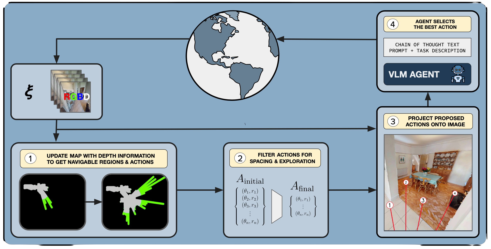

# VLMnav: End-to-End Navigation with VLMs: Transforming Spatial Reasoning into Question-Answering

This repo contains code for our paper [End-to-End Navigation with VLMs: Transforming Spatial Reasoning into Question-Answering](https://arxiv.org/abs/2411.05755).

For a brief overview, check out the project [webpage](https://jirl-upenn.github.io/VLMnav/)!

For any questions, please contact [Dylan Goetting](https://github.com/dylan-goetting).


<p align="center">
  
  <p align="center">Overview of our navigation framework</p>  
</p>

We present a novel framework to transform a Vision and Language Model (VLM) into an end-to-end navigation policy. Unlike traditional navigation approaches that separate perception, planning, and control, our method uses a VLM to directly select actions in one step. This open-ended approach allows zero-shot navigation without prior exposure to navigation-specific data, generalizing to various downstream navigation tasks.

Our method comprises four key components:
1. **Navigability** - Estimating distances to obstacles using a depth image.
2. **Action Proposer** - Determining a set of actions that avoid obstacles and encourage exploration.
3. **Projection** - Projecting potential actions into the first-person view.
4. **Prompting** - Selecting an action through a carefully crafted prompt, utilizing the VLM.


<br><br>


# ⚙️ Installation and Setup:
<div onclick="copyToClipboard(this)">

Create the conda environment and install all dependencies, notably habitat_sim. Make sure you are in the VLMnav directory:
```bash
conda create -n vlm_nav python=3.9 cmake=3.14.0
conda activate vlm_nav
conda install habitat-sim=0.3.1 withbullet headless -c conda-forge -c aihabitat

pip install -e .

pip install -r requirements.txt
```

## Habitat-Matterport 3D Research [Dataset](https://aihabitat.org/datasets/hm3d/)

You will need to get access by following instructions at: [https://matterport.com/habitat-matterport-3d-research-dataset](https://matterport.com/habitat-matterport-3d-research-dataset)


After getting access to the dataset, you will need to generate a matterport API Token:

1. Navigate to https://my.matterport.com/settings/account/devtools
1. Generate an API token
1. Your API token ID then functions as your username,
 and your API token secret functions as your password,

Now download the val scenes by running this command:
```
python -m habitat_sim.utils.datasets_download --username <api-token-id> --password <api-token-secret> --uids hm3d_val_v0.2
```

## Benchmark Datasets
1. Download the GOAT-Bench episode dataset from [here](https://drive.google.com/file/d/1N0UbpXK3v7oTphC4LoDqlNeMHbrwkbPe/view?usp=sharing).
1. Download the ObjectNav dataset from [here](https://dl.fbaipublicfiles.com/habitat/data/datasets/objectnav/hm3d/v2/objectnav_hm3d_v2.zip)

## Dataset Folder Structure

Our code requires all above data to be in a `data` folder in the following format. Move the downloaded goat_bench, objectnav and HM3D folders into the following configuration:

```bash
├── VLMnav/
│  ├── data
│  │  ├── scene_datasets/
│  │  │  ├── hm3d/
│  │  │  │  ├── val/
│  │  │  │  │   ├── 00800-TEEsavR23oF/
│  │  │  │  │   │   ├── 00800-TEEsavR23oF.navmesh
│  │  │  │  │   │   ├── 00800-TEEsavR23oF.glb
│  │  │  │  ├── hm3d_annotated_basis.scene_dataset_config.json
│  │  ├── datasets/
│  │  │  ├── objectnav_hm3d_v2/
│  │  │  │  ├── val
│  │  │  ├── goat_bench/
│  │  │  │  ├── hm3d/
│  │  │  │  │  ├── v1/
│  │  │  │  │  │  ├── val_seen/
│  │  │  │  │  │  ├── val_seen_synonyms/
│  │  │  │  │  │  ├── val_unseen/
```
## API Key
To use the Gemini models like we have set up, paste an api key into the .env file for the variable called GEMINI_API_KEY. To use a different VLM, we define a VLM class in src.vlm.py that can be extended to implement any VLM
   
# 🚀 Trajectory Visualization


To visualize a sample trajectory, run the following command:

```bash
python scripts/main.py --config ObjectNav 
```
<p align="center">
  In the logs/ directory, there should be saved gif that looks similar to this
  <br>
  
<p>

## Parallel Evaluation

To evaluate VLMnav at scale (the ObjectNav val split contains 1000 episodes), we provide a framework for parallel evaluation. The file ```parallel.sh``` contains a script to distribute K instances over N GPUs, and for each of them to run M episodes. Note each instance consumes ~750MB of GPU memory. A local flask server is intialized to handle the data aggregation, and then the aggregated results are logged to wandb. Make sure you are logged in with `wandb login`

This implementation requires `tmux` to be installed. Please install it via your package manager:

- Ubuntu/Debian: `sudo apt install tmux`
- macOS (with Homebrew): `brew install tmux`

```bash
# parallel.sh
NUM_GPU=5
INSTANCES=50
NUM_EPISODES_PER_INSTANCE=20
MAX_STEPS_PER_EPISODE=40
TASK="ObjectNav"
CFG="ObjectNav"
NAME="ours"
...
```

## Custom experiments/ablation
To run your own configuration, or the ablations detailed in the paper, refer to the YAML file detailing the configuration variables. 

```yaml
# config/ObjectNav.yaml
task: ObjectNav
agent_cls: ObjectNavAgent
env_cls: ObjectNavEnv

agent_cfg:
  navigability_mode: 'depth_sensor' # one of ['none' (ours w/o nav), 'depth_estimate' (ZoeDepth), 'segmentation' (Segformer), 'depth_sensor' (Ours)]
  project: true # to run the w/o proj baseline
  pivot: false
  context_history: 0 
  explore_bias: 4 
  max_action_dist: 1.7
  min_action_dist: 0.5

cont...
```
# 📝 Citation

If you use this code or framework in your research, please consider citing:

```
@inproceedings{
      goetting2024endtoend,
      title={End-to-End Navigation with VLMs: Transforming Spatial Reasoning into Question-Answering},
      author={Dylan Goetting and Himanshu Gaurav Singh and Antonio Loquercio},
      booktitle={Workshop on Language and Robot Learning: Language as an Interface},
      year={2024},
    }
```
